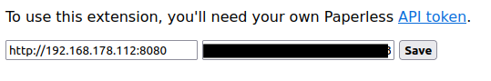

# paperless-thunderbird
A simple thunderbird plugin for sending attachments to your paperless-ngx instance.
Adds a send-to-paperless button in the header of every email.

## Screenshots & Config

See the [paperless-ngx documentation](https://docs.paperless-ngx.com/api/#authorization) for obtaining your API key.
